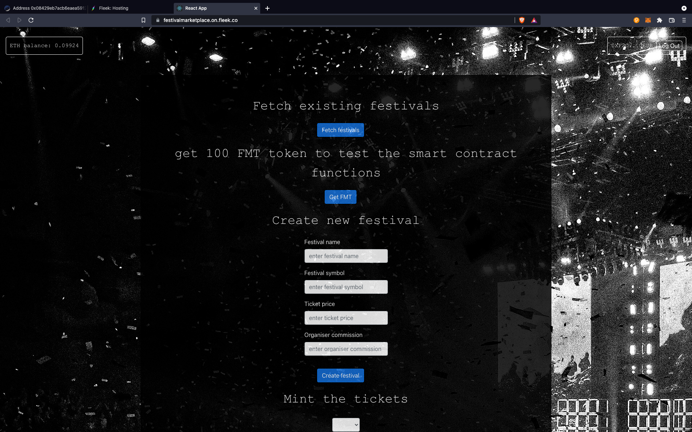

# Festival Tickets Marketplace

This application implements a festival ticketing system running on a blockchain. It allows an organiser to create festivals and sell the tickets, represented as NFTs, on the app. It also features a marketplace to allow people sell the tickets they bought. The ticket price cannot be higher than 110% of the previous price and the organiser can choose to receive a commission (up to 10%) on these transactions. An application is available online at this address to test the smart contracts: [`https://festivalmarketplace.on.fleek.co/`](https://festivalmarketplace.on.fleek.co/).

## 

## Smart Contracts

The application uses four different smart contracts that inherits from the openzeppelin library:

1. `FestivalMarketToken.sol`: this is the ERC-20 token that represents the currency used to buy and sell tickets. Its name and symbol are `FestivalMarketToken`and `FMT`.
2. `FestivalTicket.sol`: this is the ERC-721 token that represents the festival tickets. The organiser of the festival chooses the price per ticket.
4. `TransactionsLogic.sol`: this is the contract that handles the transactions with the ERC-20 token. If a buyer has enough FMT, the ticket is on sale and the buyer is not the seller, the ticket is transferred to the new owner. The organiser's commission is handled in this contract. 
3. `FestivalMarketPlace.sol`: this contract allows the owner easily create festivals. Everytime the organiser creates a new festival, it creates an instance of the `TransactionsLogic`contract as well as an instance of `FestivalTicket`.

In the current implementation, only the `FestivalMarketPlace`and the `FestivalMarketToken`are unique. It means that there can only be one festival organiser and that the ERC-20 transactions are all linked to the deployed `FestivalMarketToken`.  

## How To Use 

We developed a web interface to demonstrate the different functionalities of the decentralized application. You will need [Metamask](https://metamask.io/) to test the app. The application has been tested on Mac OS.

Here are the different steps to run the app. 

1. Download or clone this repository.

2. In a terminal, from the the root directory, run:  

- `yarn`

3. In a terminal, from the dapp directory, run:

- `yarn`
- `yarn start`

This makes the app available in a web browser at the address [`http://localhost:3000`](http://localhost:3000).

4. If everything succeeded, you should see the following website: 

In case you are trying to import the `Organiser`account after this step in Metamask without using the mnemonic but rather using the private key, you might need to reconnect to the `ganache-cli` RPC and then, make sure that the account is connected to the website. It should have a balance of 99,xx ETH.  

4. At the bottom of the page, in the `Smart Contracts Logs`, you should see the address of the `Festival Market Token` contract. Add this token to the `Organiser` account and send some `FMT` to the `Customers`. 

### Create a Festival

To create a festival, make sure that the `Organiser` account is selected in Metamask, then, give the festival a name, a symbol, choose the ticket price as well as the organiser commission. The price should be a positive number and the name and symbols should be strings. 

Metamask should show you a transaction, click on confirm. You can check the status of the transaction in `Smart Contracts Logs`.
If the account is not the `Organiser` or if you try to create a festival with the same name as an existing festival, the smart contract will throw an error. 

### Mint The tickets 

Select the festival you created in the dropdown list and click on `Mint Tickets`. Metamask should show you 40 transactions and it might also say "Gas limit must be at least 21000". If this is the case, wait until the message disappears and accept the 40 transactions. Creating the 1000 tickets with a single transaction is currently not possible with this implementation. 

If the account is not the `Organiser`, the transaction does not succeed. If the tickets have already been minted, an alert pops up to let you know that you cannot mint anymore. 

### Buy From Organiser

In Metamask, switch to a `Customer` account. Then, select the festival you just minted the tickets for and click on `Look For Tickets`. This checks if any tickets are available to buy from the `Organiser`. An alert pops up to let you know if tickets are available. If the organiser has tickets to sell, you can select the one you want to buy and click on `Buy Ticket`. Metamask should show you two transactions. The first one gives the authorization to the `TransactionsLogic`contract to spend the `FMT` and the second allows you to buy the ticket. Do not change the festival after the ticket id selection or you might end up buying a ticket for a different event. The organiser cannot buy its own tickets.

### Sell On Secondary Market

From the `Customer` account, select the festival then, click on `Look For Tickets`. If the account owns festival tickets, it is allowed to sell them on the marketplace. Select the ticket you want to sell, write the selling price and click on `Set On Sale`. Accept the transaction in Metamask. You can put the same ticket on sale again with a different price. If the price is more than 110% higher than the price the ticket was bought at, the transaction will fail.

### Buy On Secondary Market

From a different `Customer` account, select the festival then, click on `Look For Tickets`. If tickets are available on the secondary market for the selected festival, an alert pops up to let you know that tickets were found. Select the ticket id, an alert pops up to tell you the price of the ticket. Click on `Buy Ticket`. Accept the transaction in Metamask. The `Customer` can now sell the ticket on the secondary market. The `Organiser` cannot buy on the secondary market. 

### Ticket Owners Per Festisval

Select the festival then, click on `Get Owners`. The list of `Customers` who owns tickets appears in the `Smart Contract Log` section. 
