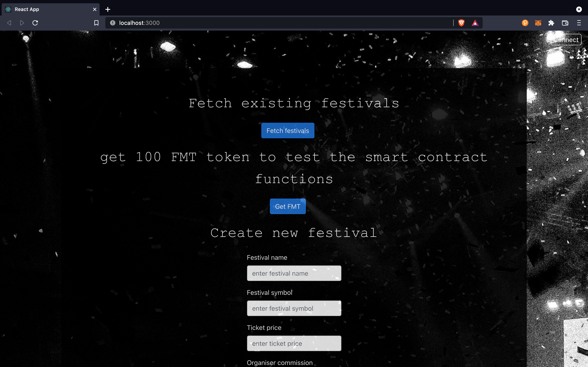

# Festival Tickets Marketplace

This application implements a festival ticketing system running on a blockchain. It allows an organiser to create festivals and sell the tickets, represented as NFTs, on the app. It also features a marketplace to allow people to sell the tickets they bought. The ticket price cannot be higher than 110% of the previous price and the organiser can choose to receive a commission (up to 10%) on these transactions. An application is available online at this address to test the smart contracts: [`https://festivalmarketplace.on.fleek.co/`](https://festivalmarketplace.on.fleek.co/). The application works only on the Rinkeby testnet.

## Prerequisites

- Node.js >= 16.4
- Truffle and Ganache: `npm i -g truffle` & `npm i -g ganache-cli``
- Yarn

## Directories

- `contracts`: contains the solidity files
- `dapp`: contains the dapp (react)
- `migrations`: folder that holds the deploy scripts
- `test`: folder containing the test script

## Smart Contracts

The application uses four different smart contracts that inherits from the openzeppelin library:

1. `FestivalMarketToken.sol`: this is the ERC-20 token that represents the currency used to buy and sell tickets. Its name and symbol are `FestivalMarketToken`and `FMT`.
2. `FestivalTicket.sol`: this is the ERC-721 token that represents the festival tickets. The organiser of the festival chooses the price per ticket.
4. `TransactionsLogic.sol`: this is the contract that handles the transactions with the ERC-20 token. If a buyer has enough FMT, the ticket is on sale and the buyer is not the seller, the ticket is transferred to the new owner. The organiser's commission is handled in this contract. 
3. `FestivalMarketPlace.sol`: this contract allows the owner easily create festivals. Everytime the organiser creates a new festival, it creates an instance of the `TransactionsLogic`contract as well as an instance of `FestivalTicket`.

In the current implementation, only the `FestivalMarketPlace`and the `FestivalMarketToken`are unique. It means that there can only be one festival organiser and that the ERC-20 transactions are all linked to the deployed `FestivalMarketToken`.  

## How To Install  

We developed a web interface to demonstrate the different functionalities of the decentralized application. You will need [Metamask](https://metamask.io/) to test the app. The application has been tested on Mac OS.

Here are the different steps to run the app. 

1. Download or clone this repository.

2. Create a `.env` file containing `RINKEBY_MNEMONIC` & `RINKEBY_INFURA_PROJECT_ID`. They will be used to migrate the smart contracts.

3. Make sure to get some ETH from a Rinkeby faucet to deploy your smart contracts [Faucet](https://faucets.chain.link/rinkeby).

4. In a terminal, from the the root directory, run:  

- `yarn`
- `truffle migrate --rinkeby` this will compile the smart contracts and deploy them on the Rinkeby testnet.

5. In a terminal, from the dapp directory, run:

- `yarn`
- `yarn build:copy` this will copy the abi to the dapp folder
- `yarn start` this makes the app available in a web browser at the address [`http://localhost:3000`](http://localhost:3000).

**When reloading the page, the contracts are lost, the button `Fetch festival`reloads the smart contracts**
**When switching accounts in Metamask, the contracts are lost as well. Again, the button `Fetch festival`reloads the smart contracts**

## How to Run The Tests 

To run the test, in a terminal, type: `ganache-cli -p 7545` then, in a second terminal, type: `truffle test test/festivalMarketPlace.js` from the root directory of the project

## Application Flow

Assuming that you have deployed the smart contracts with an account that you control, you will be allowed to create new festivals. You also have to import this account in metamask.

1. When browsing the first time to [`http://localhost:3000`](http://localhost:3000), Metamask opens and asks to connect your account to the website. Make sure to select the Rinkeby network. If you do not see your address in the top-right corner, just click on the connect button. 

2. Click on the `Fetch festivals` button. This is important because it fetches the smart contracts from the blockchain and make sure that you can interact with them in the following steps. If you reload the page or change the account in metamask, you need to click on this button again. At the bottom of the page, you can see if festivals are already deployed on the blockchain. 

3. Fill the festival details for the festival you want to create (eg: ConsensysFestival, CF, 1, 1). Do not enter random characters for the ticket price and the commission, use only numbers. Entering a commission higher than 10 will cause an error because the commission cannot be higher than 10% and the festival will not be created. Click on `Create festival`. Metamask opens and ask you to sign the transaction. The logs at the bottom shows you that the transaction is pending. This means your festival is being created. 

After a short time, the log changes and says that the festival is created.

You can see the transaction on [`https://rinkeby.etherscan.io/`](https://rinkeby.etherscan.io/). Just right click on `here` and open in a new tab. 

4. Click on `Mint tickets` to mint the tickets for the festival. It opens Metamask again and ask you to sign the transaction. This mints 5 tickets at once. You can do this operation one time only. If you click again when the transaction has succeeded, it alerts you that tickets have already been minted.

5. Change the account in Metamask and click on `Fetch festivals` again. Make sure that you have test ETH on the account to pay for the gas.

6. Click on `Get FMT`. This is an ERC-20 faucet that gives you 100 FMT to test the smart contracts. 

7. Under `Buy from the organiser`, select the festival in the menu and click on `Find tickets`. If the tickets have been minted an alert tells you so. Select the id of the ticket you want to buy. You have to approve two transactions. The first one is to allow the `TransactionsLogic` smart contract to transfer the FMT token and the next one is to confirm the purchase. Again, the logs at the bottom shows that a transaction is pending. After a while, it should show that it has succeeded. 

